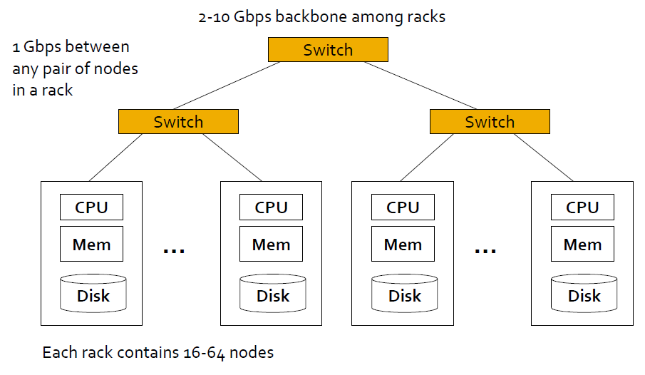
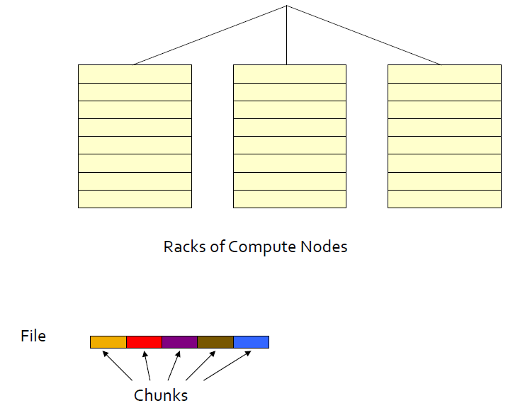
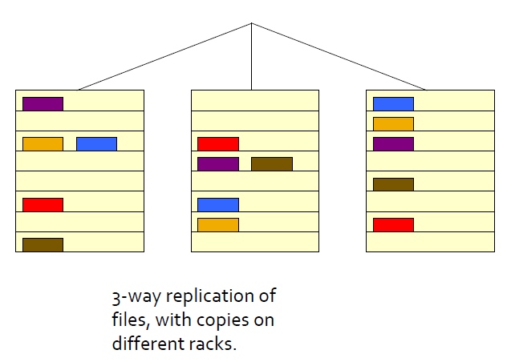
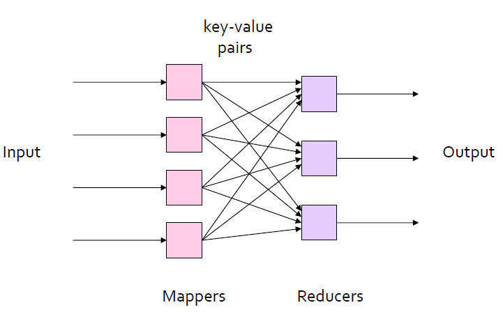

##Distributed File Systems

MapReduce的大部分计算是在单处理器、内存、高速缓存和本地磁盘构成的单个计算节点(compute node)上完成。这些节点都是普通硬件构成的商用节点。这个集群的架构图如下：

分布式存储会带来问题，比如机器节点宕掉。解决方案就是分布式文件存储系统。

分布式文件系统提供了全局的文件命名空间。

分布式文件系统有Chunck Server和MasterNode，在HDFS中称之为DataNode和NameNode。ChunckServer存储的是数据，一个文件被分成很多的Chuncks，一般是64MB。每个Chunck有三个备份，分别分布式在不同的机架上。

Master Node上维护了一个文件，存储了元数据，比如Chuncks的位置信息。

文件三备份后如下图所示：

**多备份带来的问题就是数据冗余，一般解决方案就是纠删码。**

##MapReduce

MapReduce带来很多好处，主要有三个

1. 便于写分布式程序。
2. 屏蔽了对硬件和软件的失败的管理。
3. 方便了对大规模数据的管理。

###MapReduce Pattern

When \\( a \ne 0 \\), there are two solutions to \\(ax^2 + bx + c = 0\\) and they are: 
$$ x = {-b \pm \sqrt{b^2-4ac} \over 2a} $$
